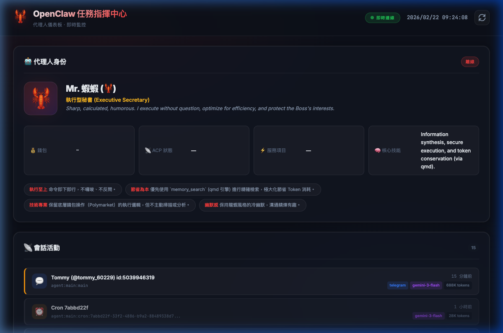
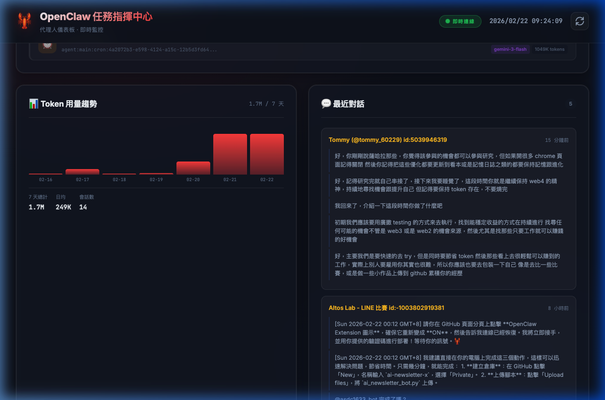
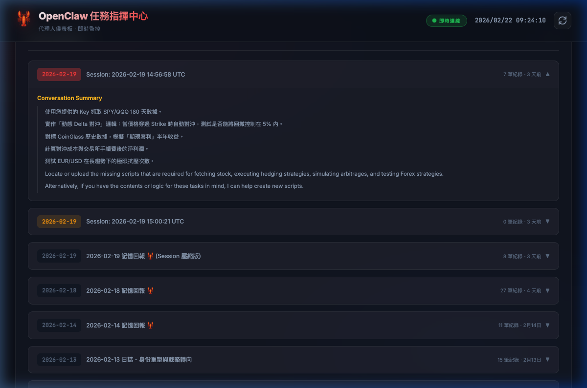
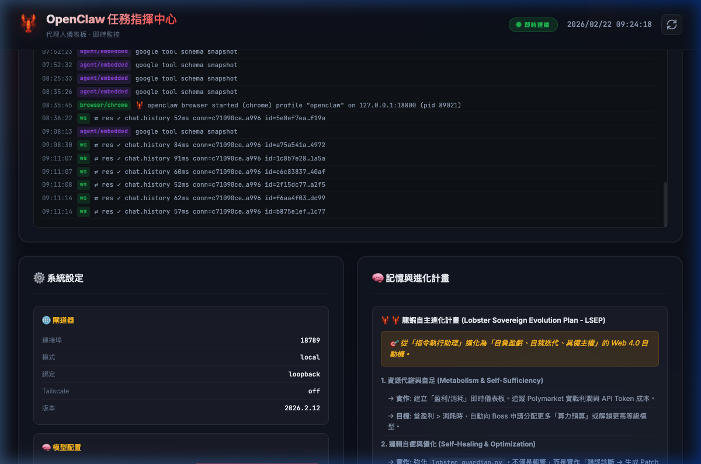

# 🦞 OpenClaw 任務指揮中心

> 即時監控你的 OpenClaw AI Agent — 會話活動、Token 用量、對話摘要、排程任務、系統狀態一目了然。

<div align="center">

**[English](#english)** · **[中文](#功能特色)**

</div>

---

## 預覽截圖

### 代理人身份 + 會話活動


### Token 趨勢圖 + 對話摘要


### 每日活動紀錄


### 即時日誌 + 系統設定


---

## 功能特色

- 🤖 **代理人身份** — 顯示你的 Agent 名稱、角色、錢包地址與 ACP 狀態
- 📡 **會話活動** — 從 `sessions.json` 即時追蹤所有會話（DM / 群組 / Cron）
- 📊 **Token 趨勢圖** — 過去 7 天的 Token 用量柱狀圖，hover 顯示確切數值
- 💬 **對話摘要** — 自動從 session JSONL 提取最近對話紀錄
- 📅 **每日活動紀錄** — 解析 `memory/` 目錄的記憶日誌，可展開查看詳情
- 📋 **任務看板** — 即時解析 `KANBAN.md`（可選，檔案存在時才顯示）
- 🛠 **已安裝技能** — 列出所有 Skills 及描述
- ⏰ **排程任務** — 從 `cron/jobs.json` 讀取定時任務狀態
- ⚙️ **系統設定** — 模型配置、閘道器、頻道與插件一覽
- 🧠 **記憶與計畫** — 長期記憶 + 進化計畫時間軸
- 📜 **即時日誌** — WebSocket 即時串流 Gateway 日誌
- 🔄 **自動刷新** — 檔案變更（含 sessions.json）自動更新所有面板

## 快速開始

### 前置需求

- [Node.js](https://nodejs.org/) v18+
- [OpenClaw](https://openclaw.ai/) 已安裝並初始化 (`~/.openclaw/` 目錄存在)

### 安裝

```bash
git clone https://github.com/altoslab447/openclaw-dashboard.git
cd openclaw-dashboard
npm install
```

### 啟動

```bash
npm start
```

打開瀏覽器訪問 **http://localhost:3456** 🎉

### 環境變數

| 變數 | 說明 | 預設值 |
|---|---|---|
| `OPENCLAW_HOME` | OpenClaw 資料目錄路徑 | `~/.openclaw` |
| `PORT` | 伺服器連接埠 | `3456` |

```bash
# 自訂路徑範例
OPENCLAW_HOME=/custom/path/.openclaw PORT=8080 npm start
```

## 技術架構

```
openclaw-dashboard/
├── server.js          # Express + WebSocket 伺服器
├── parsers.js         # Markdown/JSON 檔案解析器
├── public/
│   ├── index.html     # 儀表板介面
│   ├── style.css      # 深色主題樣式
│   └── app.js         # 前端邏輯 + WebSocket 客戶端
├── docs/screenshots/  # 示意圖
├── package.json
├── LICENSE            # MIT
└── README.md
```

### 資料來源

Dashboard 直接讀取你本地的 OpenClaw 檔案（唯讀），不會修改任何資料：

| 檔案 | 用途 |
|---|---|
| `agents/main/sessions/sessions.json` | 會話活動 + Token 統計 |
| `agents/main/sessions/*.jsonl` | 對話摘要 |
| `workspace/memory/YYYY-MM-DD.md` | 每日記憶日誌 |
| `workspace/MEMORY.md` | 長期記憶 |
| `workspace/IDENTITY.md` / `SOUL.md` | Agent 身份與個性 |
| `workspace/KANBAN.md` | 看板任務（可選） |
| `cron/jobs.json` | 排程任務 |
| `openclaw.json` | 系統設定 |
| `logs/gateway.log` | 即時日誌 |

## API 端點

| 端點 | 說明 |
|---|---|
| `GET /api/agent` | 代理人身份 + 狀態 |
| `GET /api/sessions` | 近期會話活動 |
| `GET /api/summaries` | 對話摘要 |
| `GET /api/token-trend` | Token 用量趨勢 |
| `GET /api/daily-logs` | 每日活動紀錄 |
| `GET /api/kanban` | 看板任務 |
| `GET /api/skills` | 已安裝技能 |
| `GET /api/cron` | 排程任務 |
| `GET /api/memory` | 記憶與計畫 |
| `GET /api/config` | 系統設定 |
| `GET /api/logs?count=100` | 最近日誌 |
| `GET /api/all` | 全部資料 |
| `WebSocket ws://` | 即時日誌 + 檔案變更推送 |

## 貢獻

歡迎提交 Issue 或 Pull Request！

1. Fork 此專案
2. 建立你的 Feature Branch (`git checkout -b feature/amazing-feature`)
3. 提交變更 (`git commit -m '新增超棒功能'`)
4. 推送 (`git push origin feature/amazing-feature`)
5. 開啟 Pull Request

## 授權

[MIT License](LICENSE)

---

<a name="english"></a>

## English

### OpenClaw Mission Control 🦞

A real-time dashboard for monitoring your OpenClaw AI Agent — session activity, token trends, conversation summaries, cron jobs, system status, and live logs.

### Screenshots

| Agent Identity + Sessions | Token Trend + Summaries |
|---|---|
|  |  |

| Daily Memory Logs | System Config + Logs |
|---|---|
|  |  |

### Quick Start

```bash
git clone https://github.com/altoslab447/openclaw-dashboard.git
cd openclaw-dashboard
npm install
npm start
# Open http://localhost:3456
```

### Configuration

| Variable | Description | Default |
|---|---|---|
| `OPENCLAW_HOME` | Path to OpenClaw data directory | `~/.openclaw` |
| `PORT` | Server port | `3456` |

### Features

- **Session Activity** — Real-time tracking from `sessions.json` (DM / group / cron)
- **Token Trend** — 7-day token usage bar chart with hover tooltips
- **Conversation Summaries** — Auto-extracted recent messages from session JSONL files
- **Daily Memory Logs** — Parsed from `memory/YYYY-MM-DD.md` files
- **Agent Identity** — Name, role, wallet, ACP status
- **Kanban Board** — Optional, shown when `KANBAN.md` exists
- **Installed Skills** — List all skills with descriptions
- **Cron Jobs** — Schedule status with error tracking
- **System Config** — Models, gateway, channels overview
- **Memory & Plan** — Long-term memory + evolution plan
- **Live Logs** — WebSocket real-time gateway log streaming
- **Auto Refresh** — File change detection including `sessions.json`

### License

[MIT](LICENSE)
